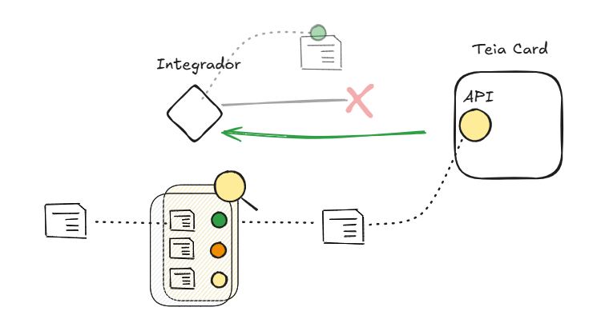

# Descrição

## Integração entre Teia Card e Sankhya

Esta integração permite sincronizar informações financeiras entre os sistemas **Teia Card** e **Sankhya**, garantindo um
fluxo contínuo e consistente de dados. Abaixo estão descritas as duas principais funcionalidades dessa integração:


## 1. Envio de Vendas e Parcelas para o Teia Card


- **Objetivo**: Capturar e transferir do Sankhya para o Teia Card informações sobre vendas e suas parcelas.
- **Processo**:
    - O sistema de integração busca no Sankhya dados sobre vendas registradas e suas parcelas associadas.
    - As informações incluem detalhes como valor da venda, número de parcelas, datas de vencimento e cliente.
    - Esses dados são então enviados para o Teia Card, onde podem ser utilizados para monitorar recebimentos.
- **Frequência**: A integração pode ser configurada para rodar periodicamente, garantindo que as informações no Teia
  Card estejam sempre atualizadas com as vendas mais recentes do Sankhya. É configurada para rodar uma vez ao dia,
  sempre com dados de `D-1`. Isso significa que as vendas e parcelas são buscadas no Sankhya e enviadas ao Teia Card com
  informações referentes ao dia anterior.

Com a conclusão dessa etapa, o cliente poderá acompanhar as vendas diretamente no Teia Card e verificar eventuais
divergências com as adquirentes. Isso facilitará o controle dos recebimentos e o monitoramento das vendas registradas no
Sankhya, garantindo uma visão integrada e atualizada dos dados financeiros.

## 2. Recebimento de Baixas das Parcelas do Teia Card e Envio para o Sankhya


- **Objetivo**: Registrar no Sankhya as baixas (pagamentos realizados) das parcelas conforme forem atualizadas no Teia
  Card.
- **Processo**:
    - O sistema de integração verifica no Teia Card as baixas das parcelas, identificando quais foram efetivamente
      pagas.
    - Essas informações incluem identificador da parcela, data de pagamento e valor pago.
    - O sistema então envia esses dados de baixa para o Sankhya, atualizando o status das parcelas como pagas.
- **Frequência**: As baixas das parcelas registradas no Teia Card também são enviadas ao Sankhya com dados de D-1,
  mantendo ambos os sistemas sincronizados com atualizações diárias.

Ao concluir essa etapa, o cliente poderá visualizar, no Sankhya, todas as vendas que foram efetivamente pagas pela
adquirente ou banco.

## Benefícios da Integração

- **Redução de Erros Manuais**: A automação do processo minimiza a necessidade de entrada manual de dados, reduzindo
  erros e inconsistências.
- **Maior Controle Financeiro**: Ambos os sistemas podem ter uma visão consolidada das vendas e recebimentos,
  facilitando o controle financeiro e tomada de decisões.

---

# Configurações

## Configuração para Envio de Vendas e Parcelas ao Teia Card

Para realizar o envio de dados de vendas e parcelas do Sankhya para o Teia Card, é necessário configurar o sistema de
integração para acessar a API do Sankhya. Abaixo estão os passos e parâmetros de configuração necessários:


### 1. **Usuário de Acesso**

Defina o usuário autorizado para a integração. Isso permite que o sistema de integração autentique e busque
os dados necessários no Sankhya. Esse é um usuário [Sankhya ID](https://login.sankhya.com.br/).

```dotenv
SANKHYA_USERNAME=integracao.nnsankhya@netunna.com.br
```

A autenticação acontece através da API
sankhya. [documentação sankhya](https://developer.sankhya.com.br/reference/api-de-integra%C3%A7%C3%B5es-sankhya)

```text
https://api.sankhya.com.br/login
```

#### Permissões concedidas

Uma vez permitido, a empresa será listada nas permissões concedidas ao usuário.


#### Autenticação obsoleta

A autenticação não será realizada por métodos alternativos que envolvem acesso direto à base de dados do cliente.

Por exemplo, usando `MobileLoginSP` e Cookie com `JSESSIONID`.

```http request
POST http://client.xx.ativy.com:50093/mge/service.sbr?serviceName=MobileLoginSP.login&outputType=json
Content-Type: application/json

{
    "serviceName": "MobileLoginSP.login",
    "requestBody": {
        "NOMUSU": {
            "$": "USUARIO 1"
        },
        "INTERNO":{
            "$": "password1"
        },
        "KEEPCONNECTED": {
            "$": "S"
        }
    }
}
```

```http request
GET http://client.xx.ativy.com:50092/mge/service.sbr?serviceName=DbExplorerSP.executeQuery&outputType=json
Cookie: JSESSIONID=avvmuddfkuzNHdxwDhzddp0f8F52e13d4.master; path=/mge
Content-Type: application/json

{
    "serviceName": "DbExplorerSP.executeQuery",
    "requestBody": {
        "sql": "SELECT * FROM TSIEMP EMP WHERE CODEMP=1"
    }
}
```

Portanto, não será necessário informar endereços URL, como, por exemplo:

- `client-test.sankhyacloud.com.br/mge`
- `client.sankhyacloud.com.br/mge`
- `client.xx.ativy.com:30029`

### 2. **Token**

Para acessar a API, configure o token de autenticação para o ambiente correto (homologação ou produção). Este token
autoriza o sistema a se comunicar com a API do Sankhya.

```dotenv
SANKHYA_TOKEN=aaaaaaaa-bbbb-cccc-dddd-eeeeeeeeeeee
```

### 3. **Autorização do DbExplorer**

O sistema de integração precisa de autorização no serviço `DbExplorerSP`, disponível via API do Sankhya. Essa
autorização permite executar consultas SQL diretamente no sistema, possibilitando a captura de dados de vendas e suas
parcelas.
> "serviceName": "DbExplorerSP.executeQuery"

Exemplo de SQL:

```sql
-- consultar vendas 
select t2.*
from (select rownum AS "rn", t1.*
      from (select "TX".*
            from (select "CAB"."NUNOTA",
                         "CAB"."NUMNOTA",
                         "CAB"."DTNEG",
                         "CAB"."VLRNOTA",
                         "TEF"."NUMNSU"
                  from "TGFCAB" CAB
                           inner join "TGFFIN" FIN on "CAB"."NUNOTA" = "FIN"."NUNOTA"
                           inner join "TGFTIT" TIT on "FIN"."CODTIPTIT" = "TIT"."CODTIPTIT"
                           inner join "TGFTEF" TEF
                                      on "TEF"."NUFIN" = "FIN"."NUFIN" and "TEF"."DESDOBRAMENTO" = "FIN"."DESDOBRAMENTO"
                  where "CAB"."CODEMP" = 12
                    and "CAB"."DTNEG" = TO_DATE('20240531', 'YYYYMMDD')
                  group by "TEF"."NUMNSU", "CAB"."NUNOTA", "CAB"."NUMNOTA", "CAB"."DTNEG", "CAB"."VLRNOTA") TX) t1) t2
where t2."rn" between 1 and 2500

-- consultar parcelas 
select "CAB"."NUNOTA",
       "TEF"."NUMNSU",
       "TEF"."AUTORIZACAO",
       "TEF"."BANDEIRA",
       "TEF"."NUFIN",
       "TEF"."VLRTRANSACAO",
       "TIT"."CODTIPTIT",
       "TIT"."DESCRTIPTIT",
       "TIT"."FISCAL",
       "FIN"."CODPARC",
       "FIN"."DESDOBRAMENTO",
       "FIN"."DTVENC"
from "TGFCAB" CAB
         inner join "TGFFIN" FIN on "CAB"."NUNOTA" = "FIN"."NUNOTA"
         inner join "TGFTIT" TIT on "FIN"."CODTIPTIT" = "TIT"."CODTIPTIT"
         inner join "TGFTEF" TEF on "TEF"."NUFIN" = "FIN"."NUFIN" and "TEF"."DESDOBRAMENTO" = "FIN"."DESDOBRAMENTO"
where "CAB"."NUNOTA" in (76018, 76028)
```

> Nao é possivel realizar a mesma consulta usando o serviço `LoadRecord`.

### 4. **Buscar somente vendas.**

Alguns clientes Sankhya utilizam a tabela `TGFCAB` para armazenar dados que não estão diretamente relacionados a
vendas. Nesse caso, é importante configurar um filtro para garantir que apenas os dados de vendas sejam considerados.
Para isso, defina o identificador do tipo de operação de venda:
Pode existir mais de um código.

```dotenv
SANKHYA_SALE_OPERATION_TYPE_ID=3200,3201,3202
```

> Conhecido como TOP na Sankhya

### 5. **Bandeiras** <a id="brand-list"></a>

Abaixo está a descrição das bandeiras mapeadas e aceitas no Sankhya. No sistema Sankhya, a tabela que contém as
informações das bandeiras é `TGFTEF.BANDEIRA`.

| Sankhya          | Teia Card |
|------------------|-----------|
| MASTER           | 2         |
| MASTERCARD       | 2         |
| VISA             | 1         |
| AMEX             | 3         |
| AMERICAN EXPRESS | 3         |
| ELO              | 6         |
| HIPER            | 4         |
| HIPERCARD        | 4         |

Para mais detalhes sobre as bandeiras permitidas no Teia Card, consulte
a [documentação da API](https://api.saferedi.nteia.com/api/documentation/#api-Enumerador-Bandeira).


> Variações de maíusculo e minusculo e acento das palavras são aceitas, Ex: `Visa`, `MasterCard`

### 6. **Adquirentes** <a id="acquire-list"></a>

Abaixo está a descrição das adquirentes mapeadas e aceitas no Sankhya. No sistema Sankhya, a coluna que contém o nome da
adquirente é `TGFTIT.FISCAL`.

| Sankya   | Teia Card |  
|----------|-----------|
| CIELO    | 6         |
| REDECARD | 18        |
| REDE     | 18        |
| STONE    | 24        |
| PAGARME  | 39        |

Para mais detalhes sobre as adquirentes permitidas no Teia Card, consulte
a [documentação da API](https://api.saferedi.nteia.com/api/documentation/#api-Enumerador-Adquirente).

> Variações de maíusculo e minúsculo e acento das palavras são aceitas, Ex: `RedeCard`, `Cielo`

### 7. **Meio de Captura** <a id="capture-method-list"></a>

Para identificar o tipo de captura no Sankhya, é analisado o campo `TGFTIT.DESCRTIPTIT`.

1. Por padrão é `PDV`
2. Se no campo conter a palavra `POS` será interpretado como `POS`.

| Sankya `TGFTIT.DESCRTIPTIT`    | Teia Card |
|--------------------------------|-----------|
| POS MASTERCARD/ VISA/ ELO 1X   | POS       |
| CARTÃO DE CRÉDITO              | PDV       |
| CARTÃO DE CRÉDITO              | PDV       |
| CARTÃO CRÉDITO À VISTA TEF     | PDV       |
| MASTERCARD/ VISA/ ELO 7X A 12X | PDV       |

Para mais detalhes sobre os meios de captura no Teia Card, consulte
a [documentação da API](https://api.saferedi.nteia.com/api/documentation/#api-Enumerador-MeioCaptura).

### 8. **Tipo de Serviço** <a id="service-type-list"></a>

Para identificar o tipo de serviço no Sankhya, é analisado o campo `TGFTIT.DESCRTIPTIT`.

1. Se no campo conter a palavra `DEBITO` será interpretado como `DEBITO`.
2. Se no campo conter as expressões `CREDITO`, `1X`,... ,`12X` será interpretado como `CREDITO`. Quando crédito será
   analisado o numero de parcelas, para enviar ao teia card a informação de `credito parcelado` ou
   `credito à vista`.

| Sankya `TGFTIT.DESCRTIPTIT`    | N. Parcelas | Interpretado | Teia Card                    |
|--------------------------------|-------------|--------------|------------------------------|
| CARTÃO DE CRÉDITO              | 8           | CREDITO      | (1) vendas credito à vista   |
| AMEX CREDITO 1X                | 1           | CREDITO      | (1) vendas credito à vista   |
| POS MASTERCARD/ VISA/ ELO 1X   | 1           | CREDITO      | (1) vendas credito à vista   |
| MASTERCARD 2X A 6X             | 6           | CREDITO      | (2) vendas crédito parcelado |
| MASTERCARD/ VISA/ ELO 7X A 12X | 7           | CREDITO      | (2) vendas crédito parcelado |
| CARTÃO DE DÉBITO               | 1           | DEBITO       | (3) Debito à vista           |
| ELO DEBITO                     | 1           | DEBITO       | (3) Debito à vista           |

Para mais detalhes sobre os tipos de serviço no Teia Card, consulte
a [documentação da API](https://api.saferedi.nteia.com/api/documentation/#api-Enumerador-ServicoTipo).

### 9. **Banco de dados**

Existem clientes da Sankhya que utilizam bancos de dados `Oracle` e `SQL Server`. Portanto, é fundamental especificar o
tipo
de banco de
dados para garantir que as consultas SQL sejam elaboradas de acordo com as necessidades específicas de cada cliente

| Nome       | Código |
|------------|--------|
| SQL Server | sqlsrv |
| Oracle     | ocl    |

```dotenv
SANKHYA_DB_CONNECTION=ocl
```

### 10. **Captura das vendas**

A captura das vendas ocorrerá uma vez por dia, com base na data de criação do registro. Esse processo de captura será
realizado no dia seguinte à criação do registro, ou seja, em D-1.

Uma vez que a venda é capturada, quaisquer
atualizações subsequentes feitas na venda não serão refletidas na captura realizada, mantendo o estado do registro
conforme estava no momento da captura. Dessa forma, é importante garantir que os dados estejam completos e corretos
antes da captura, pois alterações posteriores não serão consideradas.

### 11. **Captura de Empresas e Lojas**

Para capturar as empresas e suas respectivas lojas no sistema Sankhya.

#### **1. Captura das Empresas**

No Sankhya, para ser considerada uma **empresa**, o valor de `CODEMPMATRIZ` deve ser igual ao de `CODEMP`. Ou seja, a
matriz é identificada quando ela mesma é a sua própria matriz.

##### **Consulta para buscar apenas empresas (matrizes):**

```sql
SELECT "EMP"."CODEMP",
       "EMP"."RAZAOSOCIAL",
       "EMP"."CGC",
       "EMP"."CODEMPMATRIZ"
FROM "TSIEMP" EMP
WHERE "EMP"."CODEMP" = "EMP"."CODEMPMATRIZ";
```

##### **Exemplo de retorno:**

```plaintext
CODEMP        NAME                 NUMBER           CODEMPMATRIZ
5             EMPRESA 1 LTDA       10491094000100   5
```

#### **2. Captura das Lojas**

As lojas são identificadas pelo campo `CODEMPMATRIZ`, que aponta para o código da empresa matriz à qual elas pertencem.
Para capturar todas as lojas de uma determinada empresa, basta utilizar o valor de `CODEMP` da matriz como filtro no
campo `CODEMPMATRIZ`.

##### **Consulta para buscar lojas de uma empresa específica:**

```sql
SELECT "EMP"."CODEMP",
       "EMP"."RAZAOSOCIAL",
       "EMP"."CGC",
       "EMP"."CODEMPMATRIZ"
FROM "TSIEMP" EMP
WHERE "EMP"."CODEMPMATRIZ" = 5;
```

##### **Exemplo de retorno para `CODEMPMATRIZ = 5`:**

```plaintext
CODEMP        NAME                 NUMBER           CODEMPMATRIZ
10            LOJA 1 LTDA          10491094000101   5
22            LOJA 2 LTDA          10491094000102   5
```

## Recebimento de Baixas das Parcelas do Teia Card e Envio para o Sankhya


Para realizar a baixa, é o utilizado o serviço `BaixaFinanceiroSP.baixarTitulo` via API Sankhya.

Exemplo:

```js
data = {
    "serviceName": "BaixaFinanceiroSP.baixarTitulo",
    "requestBody": {
        "dadosBaixa": {
            "dtbaixa": "02/11/2024",
            "nufin": 274376,
            //...
            "valoresBaixa": {
                "tipoJuros": "I",
                "tipoMulta": "I",
                "taxaAdm": 2.48,
                "vlrDesconto": 0,
                "vlrCalculado": 105.85,
                "vlrDesdob": 108.33,
                "vlrDespesasCartorio": 0,
                "vlrJuros": 0,
                "vlrMulta": 0,
                "vlrTotal": 105.85,
                "vlrMultaNeg": 0,
                "vlrJurosNeg": 0,
                "jurosLib": 0,
                "multaLib": 0,
                "vlrMoeda": 0,
                "vlrVarCambial": 0
            },
            "dadosBancarios": {
                "codConta": 13,
                "codLancamento": 1,
                "numDocumento": 664,
                "codTipTit": 61,
                "vlrMoedaBaixa": 0,
                "contaParaCaixaAberto": 0,
                "historico": "Sk9BTw=="
            },
            "dadosAdicionais": {
                "codEmpresa": 3,
                "codTipoOperacao": 1500
            },
            //...
        }
    }
}

```

Assim que a parcela é liquidada — ou seja, quando o pagamento é realizado pela adquirente ou identificado no banco,
ela é recebida via API do Teia Card e, em seguida, enviada via API para baixa no Sankhya.


### 1. **Tipo de operação da baixa**

Para realizar a baixa, é necessário configurar o valor do campo `codTipoOperacao` na API.

```js
data = {
    "serviceName": "BaixaFinanceiroSP.baixarTitulo",
    "requestBody": {
        "dadosBaixa": {
            //...
            "dadosAdicionais": {
                "codEmpresa": 5,
                "codTipoOperacao": 14
            },
            // ...
        }
    }
}
```

[documentação Sankhya](https://ajuda.sankhya.com.br/hc/pt-br/articles/360044599934-Baixa-Financeira-pela-Central-de-Notas)


Ex: `14`, `1500`, `4300`

```dotenv
SANKHYA_SETTLEMENT_OPERATION_TYPE_ID=4300
```

### 2. **Atualização de Taxa Aministrativa**

O Sankhya não permite realizar a baixa de um título quando há divergência na taxa administrativa cobrada pelo cartão em
relação à taxa inicialmente registrada.
Por exemplo, se no Sankhya foi registrada uma taxa administrativa de `4,70`, mas o Teia Card recebeu da adquirente um
valor de `4,75`, será necessário atualizar a taxa antes de efetuar a baixa do título.
Para realizar essa atualização, utilizamos o serviço `DatasetSP.save`.

```json
{
  "serviceName": "DatasetSP.save",
  "requestBody": {
    "entityName": "Financeiro",
    "standAlone": false,
    "fields": [
      "CARTAODESC"
    ],
    "records": [
      {
        "pk": {
          "NUFIN": 323267
        },
        "values": {
          "0": 4.75
        }
      }
    ]
  }
}
```

### 3. **Liberação de limites**

A partir da versão `4.31` da Sankhya, o desconto de um título passou a exigir a liberação de limite. Para permitir a
baixa sem passar por esse processo, é necessário configurar a liberação de limites como `full` para o usuário no
evento
`29`.


### 4. **Valor Bruto da parcela**

O Sankhya não permite realizar a baixa caso seja informado um valor bruto diferente do registrado.

Por exemplo, se no Sankhya o valor bruto do título (parcela) foi registrado como `70,59` (parcela 8), mas o Teia Card
recebeu da adquirente o valor bruto de `70,66` (parcela 8), existe um a diferença entre os valores.
Essa diferença será informada como `vlrJuros` quando o valor recebido for maior ou como `vlrDesconto` quando for menor.

| Parcela | Sankhya | Teia Card | Diferença |
|---------|---------|-----------|-----------|
| 1       | 70,63   | 70,62     | 0,01      |
| 2       | 70,63   | 70,62     | 0,01      |
| 3       | 70,63   | 70,62     | 0,01      |
| 4       | 70,63   | 70,62     | 0,01      |
| 5       | 70,63   | 70,62     | 0,01      |
| 6       | 70,63   | 70,62     | 0,01      |
| 7       | 70,63   | 70,62     | 0,01      |
| 8       | 70,59   | 70,66     | 0,07      |

### Exemplo

```dotenv
# Usuário Netunna
SANKHYA_USERNAME=integracao.nnsankhya@netunna.com.br
# Codigo de Baixa
SANKHYA_SETTLEMENT_OPERATION_TYPE_ID=4300
# Codigo de vendas (TOP)
SANKHYA_SALE_OPERATION_TYPE_ID=3200,3201,3202
# Banco de dados Sankhya
SANKHYA_DB_CONNECTION=sqlsrv

SANKHYA_DAYS_TOLERANCE=3
SANKHYA_SALE_GROSS_VALUE_TOLERANCE=0.05
SANKHYA_INSTALLMENT_GROSS_VALUE_TOLERANCE=0.11
# Token Produção
SANKHYA_TOKEN=db4axxxx-6ff9-41ac-a919-0c033a3aaa12
# Token Homologação
#SANKHYA_TOKEN=c72axxxx-f5dc-4485-a5a1-b7684exxxeae
```

---

# Dados com baixa qualidade

Quando os dados estão corretamente preenchidos, é possível enviá-los via API para o Teia Card. Dessa forma, quando o
Teia Card retorna as parcelas baixadas, conseguimos identificar as parcelas e suas respectivas vendas através de um
identificador previamente enviado.


Quando os dados da venda são enviados, é possível compará-los com as informações fornecidas pela adquirente. Essa
comparação permite identificar divergências entre os dois conjuntos de dados, garantindo maior precisão no controle e na
validação das transações realizadas.


Quando não for possível enviar a venda ao Teia Card, a transação será recebida pela adquirente e disponibilizada via API
apenas após a liquidação da parcela. Nesse cenário, será necessário adotar métodos alternativos para identificar a
venda, já que ela não terá um identificador previamente enviado pelo Integrador.


## Identificação alternativa como último recurso

Esse processo deve ser utilizado apenas como último recurso. É essencial priorizar a correção dos problemas que
impedem o envio adequado das vendas, garantindo que o fluxo padrão seja mantido e evitando a necessidade de
identificação manual ou baseada em critérios alternativos.

O não envio das vendas ao Teia Card inviabiliza a comparação precisa com os dados fornecidos pela adquirente, o que
reduz a eficácia na identificação de divergências entre os sistemas.


Isso aumenta o risco de discrepâncias não
detectadas, que podem ser cobradas a mais pela adquirente. Caso o cliente perceba uma cobrança indevida, com base nas
informações do ERP, ele pode solicitar o reembolso de todo o valor pago a mais. Isso demonstra que a ferramenta cumpriu
seu papel ao permitir a identificação desses problemas, proporcionando ao cliente a oportunidade de recuperar valores
cobrados indevidamente, o que é um benefício significativo.

## Motivos para uma venda não ser enviada ao Teia Card.

Existem alguns motivos pelos quais uma venda pode não ser enviada:


1. Bandeira não permitida. [consulte a lista](#brand-list)
2. Adquirente não permitida. [consulte a lista](#acquire-list)
3. Tipo de Serviço não permitido. [consulte a lista](#service-type-list)
4. Meio de captura não permitido. [consulte a lista](#capture-method-list)
5. Nsu ausente.

## Critérios para encontrar uma venda não identificada previamente

Será utilizado um conjunto de informações essenciais para o processamento, incluindo: **valor bruto**, **NSU**, **data
da venda** e **código de autorização**. Esses dados são fundamentais para identificar as transações analisadas.

Para avaliar as transações, serão aplicados os seguintes critérios de tolerância, que determinam os limites aceitáveis
para discrepâncias ou variações nos dados. Esses critérios permite que os processos atendam aos padrões definidos,
facilitando a identificação.



### 1. **Dias de tolerância**

Número de dias para tolerância de data na conciliação:
> Exemplo: Uma venda realizada em 01/10 foi registrada no Sankhya apenas em 02/10. Como a diferença é de apenas um dia e
> está dentro da tolerância permitida, essa venda seria corretamente identificada.

```dotenv
SANKHYA_DAYS_TOLERANCE=3
```

### 2. **Tolerância de valor bruto da venda**

Margem de tolerância no valor bruto da venda.

> Exemplo: Em uma venda de 21,34 registrada na Sankhya, a adquirente informou o valor de 21,36. Como essa diferença
> está dentro da tolerância definida, a venda seria reconhecida e conciliada corretamente.

```dotenv
SANKHYA_SALE_GROSS_VALUE_TOLERANCE=0.05
```

### 3. **Tolerância de valor bruto da parcela**

Margem de tolerância no valor bruto da parcela. Em vendas parceladas em até 12x, os centavos são incluídos na
primeira parcela:

> Exemplo: Para uma venda de 565,00 dividida em 8 parcelas, a Sankhya e a adquirente aplicaram regras diferentes para
> arredondamento dos centavos. Isso gerou uma pequena diferença de 0,07 centavos em uma das parcelas, causada pelas
> variações nas regras de cálculo usadas por cada sistema.

| Parcela | Sankhya | Teia Card | Diferença |
|---------|---------|-----------|-----------|
| 1       | 70,63   | 70,62     | 0,01      |
| 2       | 70,63   | 70,62     | 0,01      |
| 3       | 70,63   | 70,62     | 0,01      |
| 4       | 70,63   | 70,62     | 0,01      |
| 5       | 70,63   | 70,62     | 0,01      |
| 6       | 70,63   | 70,62     | 0,01      |
| 7       | 70,63   | 70,62     | 0,01      |
| 8       | 70,59   | 70,66     | 0,07      |

```dotenv
SANKHYA_INSTALLMENT_GROSS_VALUE_TOLERANCE=0.11
```

### Exemplo

```dotenv
SANKHYA_DAYS_TOLERANCE=3
SANKHYA_SALE_GROSS_VALUE_TOLERANCE=0.05
SANKHYA_INSTALLMENT_GROSS_VALUE_TOLERANCE=0.11
```
